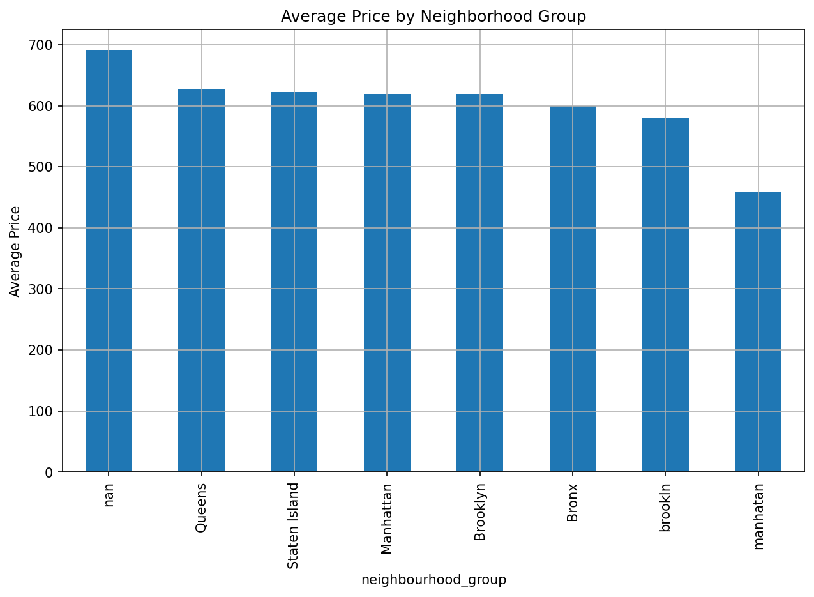
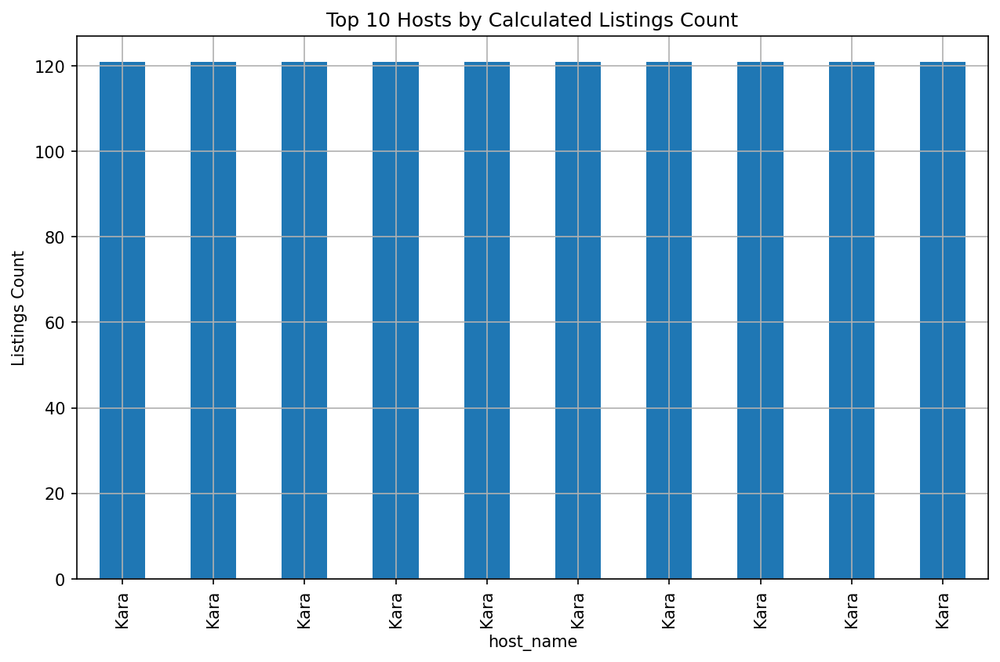
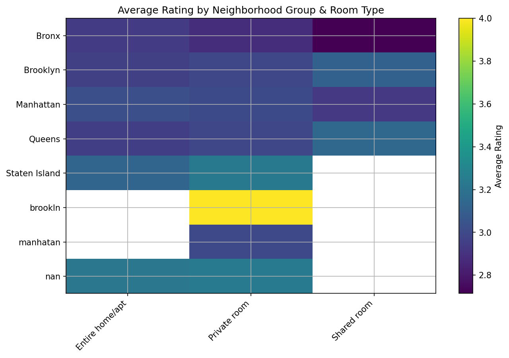

# 🏠 Airbnb NYC Data Analysis

This project explores the **Airbnb Open Data (NYC)** to uncover insights about the short-term lodging market.  
Using Python in Google Colab, the notebook walks through **data cleaning, preprocessing, EDA, and visualization** while answering 9 key business questions.

---

## 📌 Problem Statement
The hospitality industry has been reshaped by platforms like Airbnb.  
This project analyzes **New York City Airbnb listings** to understand factors driving availability, pricing, host behavior, and reviews—helping stakeholders navigate the evolving short-term accommodation market.

---

## 🔍 Key Questions Answered
1. What are the different property types in the dataset?  
2. Which neighborhood group has the highest number of listings?  
3. Which neighborhood group has the highest average prices?  
4. Is there a relationship between property construction year and price?  
5. Who are the top 10 hosts by listing count?  
6. Are hosts with verified identities more likely to get positive reviews?  
7. Is there a correlation between listing price and service fee?  
8. What is the average review rating, and does it vary by neighborhood group/room type?  
9. Do hosts with more listings maintain higher availability?

---

## 👥 End Users
- **Hosts** – optimize pricing & availability  
- **Travelers** – choose neighborhoods & room types  
- **Analysts / Researchers** – study market dynamics  
- **Policy Makers** – understand housing & tourism trends  

---

## ⚙️ Tech Stack
- **Python** (pandas, numpy, matplotlib)  
- **Google Colab / Jupyter Notebook**  
- **CSV data processing & visualization**  

---

## 🚀 How to Run
1. Clone this repository and open the notebook in **Google Colab** or Jupyter.  
2. Upload `Airbnb_Open_Data.csv` to the Colab environment.  
3. Run all cells in order.  
4. Charts & tables are saved in `/content/exports` (Colab) for easy use in reports or presentations.  

---

## 📂 Project Structure
├── Airbnb_NYC_Analysis.ipynb # Main analysis notebook
├── Airbnb_Open_Data.csv # Dataset (upload in Colab)
├── exports/ # Generated charts & CSVs
└── README.md # Project overview

---

## 📊 Sample Outputs (Preview)

Here are a few charts generated from the analysis:

### Listings by Neighborhood Group

### Average Price by Neighborhood Group

### Top 10 Hosts by Listings

### Ratings Heatmap (Neighborhood vs Room Type)

---

✨ **Author:** Mayank Kumar Singh  
📅 **Year:** 2025  

